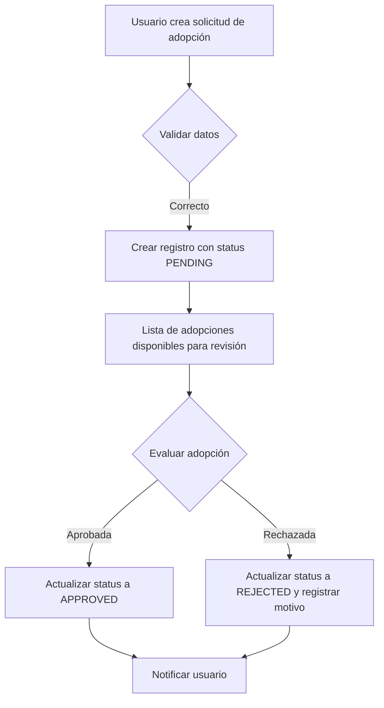

Perfecto, César. Te voy a generar una **documentación estilo GitBook / profesional**, con **estructura de carpetas, diagrama de flujo y ejemplos visuales** para tu módulo de adopciones en NestJS. Lo puedes guardar en un `.md` o usarlo directamente en GitBook.

---

# Módulo de Adopciones (NestJS)

Este módulo permite gestionar solicitudes de adopción de mascotas, desde la creación hasta la aprobación o rechazo, incluyendo la gestión de estados, preguntas de adopción y relación con usuarios y refugios.

---

## 1. Estructura de carpetas

```text
src/
└── adoptions/
    ├── adoptions.module.ts
    ├── adoptions.controller.ts
    ├── adoptions.service.ts
    ├── dto/
    │   ├── create-adoption.dto.ts
    │   └── update-adoption.dto.ts
    ├── enums/
    │   └── adoption-status.enum.ts
    └── interfaces/
        └── adoption.interface.ts
```

---

## 2. Diagrama de flujo de la lógica



---

## 3. Enum `EAdoptionStatus`

Define los posibles estados de una adopción:

```ts
enum EAdoptionStatus {
  PENDING = 'PENDING',
  APPROVED = 'APPROVED',
  REJECTED = 'REJECTED',
}

export default EAdoptionStatus;
```

---

## 4. Interfaz `IAdoption`

```ts
import EAdoptionStatus from "../enums/adoption-status.enum";

export interface IAdoption {
  id: string;
  questions: string;
  status: EAdoptionStatus;
  pets: string[];
  rejectionStatus?: string;
  userID: string;
  shelterID: string;
}
```

---

## 5. DTOs

### a) `CreateAdoptionDto`

```ts
import { IsString, IsUUID, IsArray } from 'class-validator';

export class CreateAdoptionDto {
  @IsString()
  questions: string;

  @IsArray()
  @IsString({ each: true })
  pets: string[];

  @IsUUID()
  userID: string;

  @IsUUID()
  shelterID: string;
}
```

### b) `UpdateAdoptionDto`

```ts
import { PartialType } from '@nestjs/mapped-types';
import { CreateAdoptionDto } from './create-adoption.dto';
import { IsEnum, IsOptional, IsString } from 'class-validator';
import EAdoptionStatus from '../enums/adoption-status.enum';

export class UpdateAdoptionDto extends PartialType(CreateAdoptionDto) {
  @IsOptional()
  @IsEnum(EAdoptionStatus)
  status?: EAdoptionStatus;

  @IsOptional()
  @IsString()
  rejectionStatus?: string;
}
```

---

## 6. Servicio `AdoptionsService`

Gestiona la lógica de negocio de las adopciones:

```ts
import { Injectable, NotFoundException } from '@nestjs/common';
import { IAdoption } from './interfaces/adoption.interface';
import { v4 as uuidv4 } from 'uuid';
import { CreateAdoptionDto } from './dto/create-adoption.dto';
import { UpdateAdoptionDto } from './dto/update-adoption.dto';
import EAdoptionStatus from './enums/adoption-status.enum';

@Injectable()
export class AdoptionsService {
  private adoptions: IAdoption[] = [];

  create(createAdoptionDto: CreateAdoptionDto): IAdoption {
    const newAdoption: IAdoption = {
      id: uuidv4(),
      status: EAdoptionStatus.PENDING,
      ...createAdoptionDto,
    };
    this.adoptions.push(newAdoption);
    return newAdoption;
  }

  findAll(): IAdoption[] {
    return this.adoptions;
  }

  findOne(id: string): IAdoption {
    const adoption = this.adoptions.find(a => a.id === id);
    if (!adoption) throw new NotFoundException(`Adoption with ID ${id} not found`);
    return adoption;
  }

  update(id: string, updateData: UpdateAdoptionDto): IAdoption {
    const adoption = this.findOne(id);
    Object.assign(adoption, updateData);
    return adoption;
  }

  remove(id: string): void {
    const index = this.adoptions.findIndex(a => a.id === id);
    if (index === -1) throw new NotFoundException(`Adoption with ID ${id} not found`);
    this.adoptions.splice(index, 1);
  }
}
```

---

## 7. Controlador `AdoptionsController`

Define las rutas del módulo:

```ts
import { Controller, Get, Post, Body, Patch, Param, Delete } from '@nestjs/common';
import { AdoptionsService } from './adoptions.service';
import { CreateAdoptionDto } from './dto/create-adoption.dto';
import { UpdateAdoptionDto } from './dto/update-adoption.dto';

@Controller('adoptions')
export class AdoptionsController {
  constructor(private readonly adoptionsService: AdoptionsService) {}

  @Post()
  create(@Body() createAdoptionDto: CreateAdoptionDto) {
    return this.adoptionsService.create(createAdoptionDto);
  }

  @Get()
  findAll() {
    return this.adoptionsService.findAll();
  }

  @Get(':id')
  findOne(@Param('id') id: string) {
    return this.adoptionsService.findOne(id);
  }

  @Patch(':id')
  update(@Param('id') id: string, @Body() updateAdoptionDto: UpdateAdoptionDto) {
    return this.adoptionsService.update(id, updateAdoptionDto);
  }

  @Delete(':id')
  remove(@Param('id') id: string) {
    return this.adoptionsService.remove(id);
  }
}
```

---

## 8. Módulo `AdoptionsModule`

```ts
import { Module } from '@nestjs/common';
import { AdoptionsService } from './adoptions.service';
import { AdoptionsController } from './adoptions.controller';

@Module({
  controllers: [AdoptionsController],
  providers: [AdoptionsService],
})
export class AdoptionsModule {}
```

---

## 9. Ejemplos de uso (API REST)

| Método | Ruta             | Descripción                 |
| ------ | ---------------- | --------------------------- |
| POST   | `/adoptions`     | Crear nueva adopción        |
| GET    | `/adoptions`     | Listar todas las adopciones |
| GET    | `/adoptions/:id` | Obtener adopción por ID     |
| PATCH  | `/adoptions/:id` | Actualizar adopción         |
| DELETE | `/adoptions/:id` | Eliminar adopción           |

**Body de ejemplo para crear adopción:**

```json
{
  "questions": "Tengo experiencia con perros pequeños y un patio amplio",
  "pets": ["dog-uuid-1", "dog-uuid-2"],
  "userID": "user-uuid-123",
  "shelterID": "shelter-uuid-456"
}
```

---

Si quieres, puedo hacer **una versión final con gráficos visuales de la base de datos**, mostrando las relaciones entre **usuarios, refugios y adopciones**, lista para agregar a tu documentación GitBook profesional.

¿Quieres que haga esa versión?
